# Architecture Overview

This system has two major parts: an offline ingestion/alignment pipeline and an online API serving hybrid RAG. The online API runs on Vercel and orchestrates three LLM steps per query: reranking, answering, and source explanation.

## High-Level Diagram

```mermaid
flowchart LR
  subgraph "Offline Pipeline (Batch)"
    Y1["YouTube Hybrid Downloader\n`youtube_processes/youtube_hybrid_downloader.py`"] --> T1["Raw transcripts/audio"]
    A1["Agenda Scraper\n`agenda_processes/agenda_scraper.py`"] --> A2["Structured agenda text"]
    T1 --> S1["TranscriptSegmenter\n`youtube_agenda_alignment/transcript_segmenter.py`"]
    A2 --> S2["Dynamic Agenda Analyzer\n`youtube_agenda_alignment/dynamic_agenda_analyzer.py`"]
    S1 --> AL1["Enhanced Transcript Aligner\n`youtube_agenda_alignment/enhanced_transcript_aligner(_v2).py`"]
    S2 --> AL1
    AL1 --> C1["Chunk Generator + Data Processing\n`chunk_generator.py`, `enhanced_data_processor.py`, `data_processor.py`"]
    C1 --> E1["Embeddings (OpenAI)"]
    E1 --> M[("Milvus/Zilliz\ncollection: `capstone_hybrid_rag`")]
    C1 --> N1["Concept Extraction + Loader\n`cleanup_files/concept_extraction/*.py`, `neo4j_*_loader*_concepts.py`"]
    N1 --> G[("Neo4j Graph\n(Concepts, Agenda Items, Links)")]
  end

  subgraph "Online API (Vercel)"
    Q["User Query"] --> R0
    R0["Hybrid Retrieval\nDense + Sparse (Milvus) + Graph Hints (Neo4j)"] --> L1
    L1["LLM #1: Reranker\n`_rerank_with_gpt()`"] --> CTX["Top-K Context"]
    Q --> L2["LLM #2: Answer from Context"]
    CTX --> L2
    L2 --> L3["LLM #3: Source Justifications\n`_explain_and_rerank_sources()`"]
    CTX --> L3
    L3 --> RESP["JSON Response: answer + citations"]
  end

  M --- R0
  G --- R0
```

## Online API
- Entrypoint: `api/index.py` → loads `capstone_hierarchical_rag.milvus_neo4j_hybrid_system:app`.
- Retrieval: Milvus/Zilliz dense + sparse; optional Neo4j graph hints to filter/expand results.
- Orchestration (in `milvus_neo4j_hybrid_system.py`):
  - LLM #1: `_rerank_with_gpt(query, candidates, top_k)`
  - LLM #2: Answer generation from concatenated top context
  - LLM #3: `_explain_and_rerank_sources(question, final_answer, sources)` returns per-source justifications and scores

## Offline Pipeline
- YouTube ingestion: `youtube_processes/youtube_hybrid_downloader.py`
- Agenda ingestion: `agenda_processes/agenda_scraper.py`
- Segmentation + Alignment: `youtube_agenda_alignment/transcript_segmenter.py`, `dynamic_agenda_analyzer.py`, `enhanced_transcript_aligner(_v2).py`
- Chunking: `chunk_generator.py`, `enhanced_data_processor.py`, `data_processor.py`
- Concept extraction + graph: `cleanup_files/concept_extraction/*.py`, `neo4j_*_loader*_concepts.py`
- Storage: Milvus (vectors + metadata), Neo4j (concepts, agenda-item links)

## Notable Behaviors
- Graph-guided retrieval augments dense search by filtering with related concepts/meetings from Neo4j.
- Result post-processing includes LLM reranking, answer generation, and source explanations to improve transparency and traceability. 